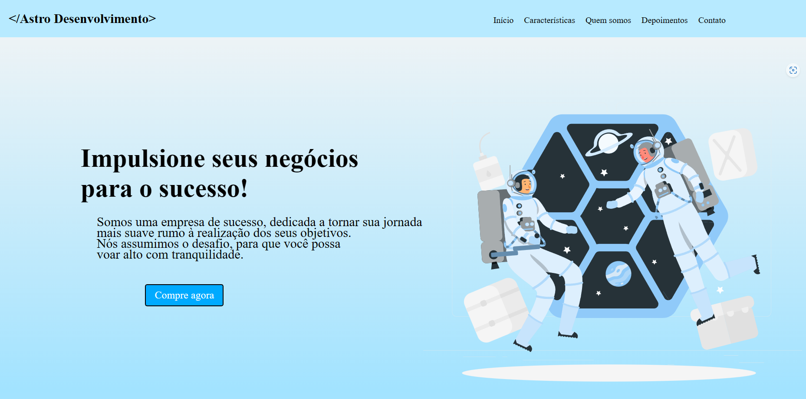
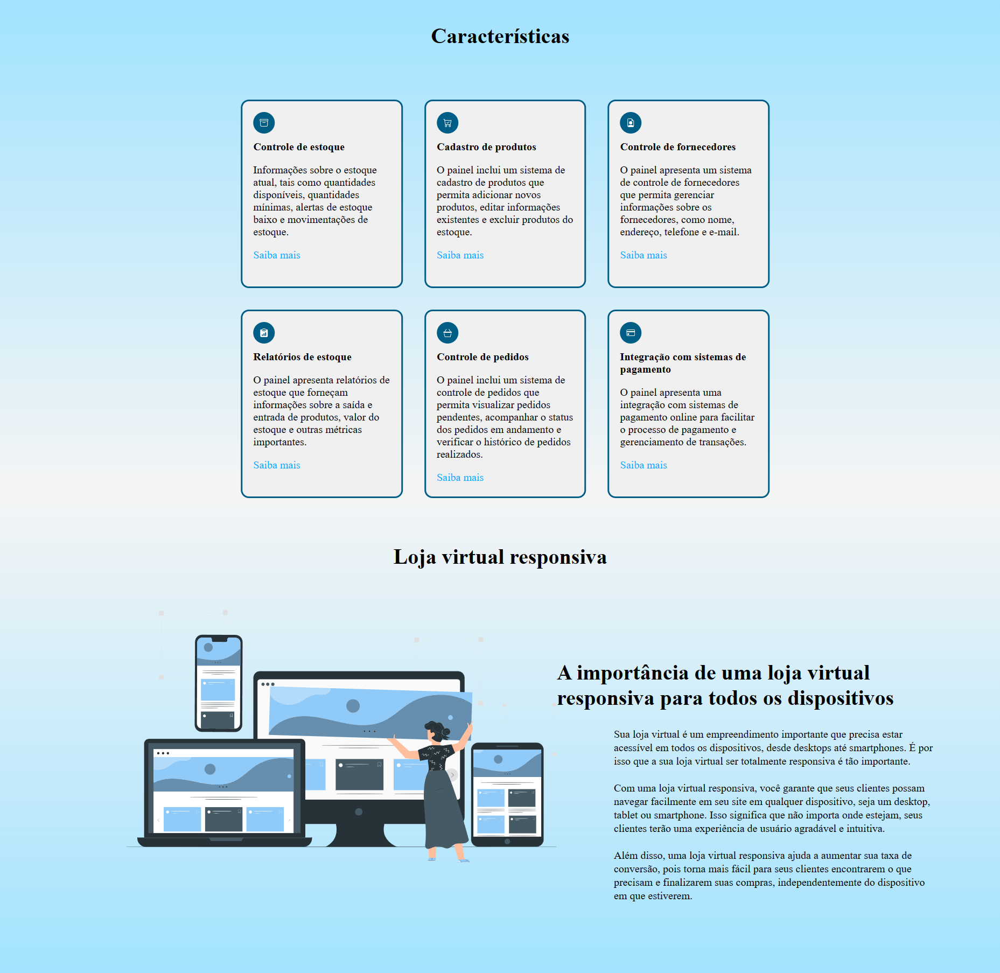
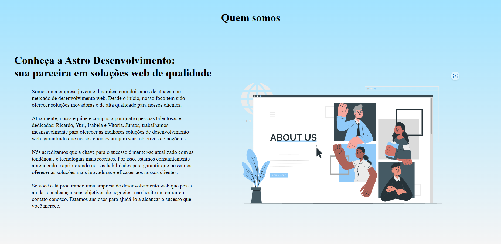
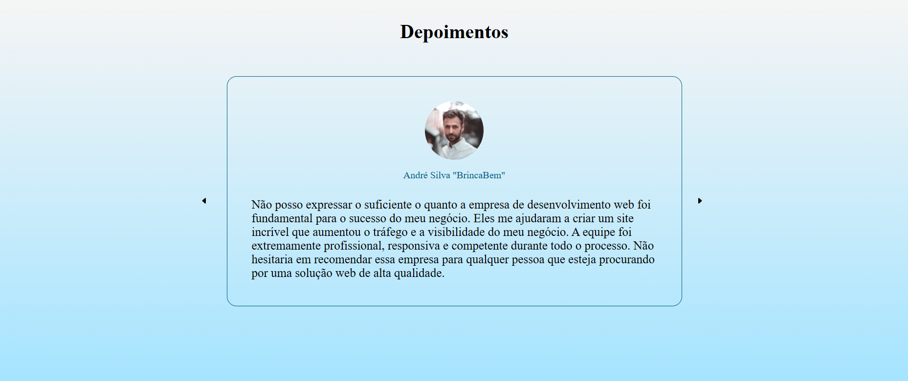

<h1 align="center">Astro Desenvolvimento - Site de Landing Page</h1>

Astro Desenvolvimento é uma empresa que se dedica a criar soluções para impulsionar seus negócios. Nosso objetivo e de ajudar empreendedores a alcançar o sucesso em suas jornadas. 

<ul>
  <li><h3>Tecnologias Utilizadas</h3></li>
  
O projeto foi desenvolvido utilizando as seguintes tecnologias:

  <ul>
    <li><b>HTML</b></li>
    <li><b>CSS</b></li>
    <li><b>JAVASCRIPT </li>
  </ul>
  
  </ul>

<ul>
  <li><h3>Essa Landing page é dividida em 5 partes sendo elas;</h3></li>
  <ul>
    <li><b>Início</b></li>
    <li><b>Características</b></li>
    <li><b>Quem Somos</b></li>
    <li><b>Depoimentos</b></li>
    <li><b>Contato</b></li>
  </ul> 
  
Vamos está falando sobre cada parte individualmente.

</ul>

<ul>
  <li><h3>Início</h3></li>
  
Na seção "Início", apresentamos o site com um texto de boas-vindas: "Impulsione seus negócios para o sucesso! Somos uma empresa de sucesso, dedicada a tornar sua jornada mais suave rumo à realização dos seus objetivos. Nós assumimos o desafio, para que você possa voar alto com tranquilidade."

</ul>

<ul>
  <li><h3>Características</h3></li>
  
Na seção "Características", apresentamos as principais vantagens do nosso painel de administração da loja virtual. Com ele, você pode gerenciar seu negócio de forma fácil e eficiente, com total controle sobre seus produtos, pedidos, clientes e muito mais. Além disso, nosso site é altamente expansível, permitindo que você adicione novas funcionalidades e recursos de acordo com suas necessidades. Tudo isso para garantir a melhor experiência para você e seus clientes.

</ul>

<ul>
  <li><h3>Quem Somos</h3></li>
  
Na seção "Quem Somos", apresentamos a nossa empresa, o Astro Desenvolvimento. Contamos um pouco sobre a nossa história e missão, mostrando por que somos a escolha ideal para quem busca um site de e-commerce de qualidade. Acreditamos que o sucesso de nossos clientes é o nosso sucesso, por isso trabalhamos incansavelmente para oferecer soluções sob medida para cada negócio.

</ul>

<ul>
  <li><h3>Depoimentos</h3></li>
  
Na seção "Depoimentos", apresentamos alguns depoimentos de clientes que já compraram sites com a Astro Desenvolvimento. Queremos que você veja o que os nossos clientes estão dizendo sobre a qualidade do nosso trabalho e o nível de satisfação que eles tiveram com a nossa empresa.

</ul>

<ul>
  <li><h3>Contato</h3></li>
  
Na seção "Contato", disponibilizamos um formulário para que você possa entrar em contato conosco caso tenha alguma dúvida ou deseje solicitar um orçamento. Queremos estar sempre à disposição para atender as suas necessidades e garantir a sua satisfação.
Ao final do site, você encontrará o nosso formulário de contato. Não hesite em nos enviar uma mensagem e teremos o prazer em responder o mais breve possível.

</ul>

  <ul>
  <li><h3>Instalação e Execução</h3></li>
  
Para executar este projeto, basta clonar este repositório e abrir o arquivo <code>index.html</code> no seu navegador de preferência.

  <code>git clone https://github.com/Ricardo-Rodrigues0/LandingPage-Astro.git</code>
</ul>

<ul>
  <li><h3>Conclusão</h3></li>

Este projeto foi desenvolvido para fins educacionais, visando aprimorar habilidades em diversas tecnologias, como HTML, CSS e JavaScript.

</ul>
